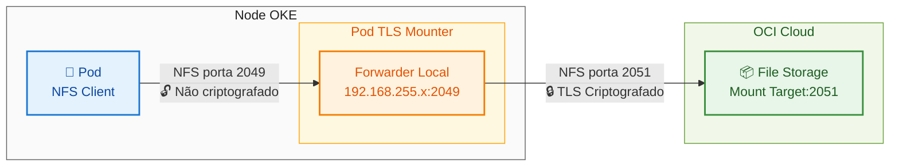

# OCI File Storage Service
# Criptografia TLS em Trânsito
## Guia de Configuração e Validação para OKE

---

## Visão Geral

Este documento fornece instruções abrangentes para configurar e validar a criptografia TLS em trânsito entre pods do Oracle Container Engine for Kubernetes (OKE) e o Oracle Cloud Infrastructure (OCI) File Storage Service (FSS).

Quando configurado adequadamente, todos os dados transmitidos entre seus pods Kubernetes e o OCI File Storage são criptografados usando TLS, garantindo a segurança dos dados durante o trânsito.

---

## Visão Geral da Arquitetura

A arquitetura de criptografia TLS consiste nos seguintes componentes:

- **Pod da Aplicação**: Monta o sistema de arquivos usando NFS padrão (não criptografado localmente)
- **Endpoint Forwarder Local**: Um endereço IP virtual (por exemplo, 192.168.255.x) criado pelo TLS mounter
- **Pod FSS TLS Mounter**: Executa no nó OKE, escuta na porta 2049 e encaminha tráfego com criptografia TLS
- **OCI File Storage Mount Target**: Recebe tráfego criptografado na porta 2051 (NFS criptografado com TLS)

### Fluxo de Dados



---

## Pré-requisitos

- Uma tenancy OCI ativa com cluster OKE implantado
- Acesso kubectl ao seu cluster OKE
- OCI File Storage Service mount target criado
- Conectividade de rede entre nós OKE e FSS mount target

---

## Instruções de Configuração

### Passo 1: Instalar o pacote oci-fss-utils no Nó do OKE

O pacote `oci-fss-utils` é necessário para habilitar a criptografia TLS em trânsito. Este pacote contém o TLS mounter que estabelece conexões seguras com o OCI File Storage.

**Configurar script de inicialização no Node Pool**

Ao criar ou editar o Node Pool no OKE, configure o seguinte script de inicialização (cloud-init):

```bash
#!/bin/bash
curl --fail -H "Authorization: Bearer Oracle" -L0 http://169.254.169.254/opc/v2/instance/metadata/oke_init_script | base64 --decode >/var/run/oke-init.sh

bash /var/run/oke-init.sh

dnf config-manager --enable ol8_developer
dnf install -y oci-fss-utils

touch /var/log/oke.done
```

**Como configurar no OCI Console:**

1. Navegue até **Developer Services** → **Kubernetes Clusters (OKE)**
2. Selecione seu cluster
3. Vá em **Node Pools** → selecione o node pool ou crie um novo
4. Em **Show advanced options** → **Initialization script**
5. Cole o script acima
6. Salve as alterações

**Nota:** Para node pools existentes, você precisará reciclar os nós para que o script seja executado.

**Verificar instalação:**

```bash
# Via SSH no nó
rpm -q oci-fss-utils
```

**Saída esperada:**
```
oci-fss-utils-<versão>.x86_64
```

### Passo 2: Criar Recursos Kubernetes com Criptografia TLS

Crie um arquivo YAML (por exemplo, `fss-tls-setup.yaml`) com a seguinte configuração:

**Obs:** O parâmetro `encryptInTransit: "true"` no PersistentVolume é fundamental para habilitar a criptografia TLS.

```yaml
---
apiVersion: v1
kind: PersistentVolume
metadata:
  name: fss-pv
spec:
  capacity:
    storage: 50Gi
  volumeMode: Filesystem
  accessModes:
    - ReadWriteMany
  persistentVolumeReclaimPolicy: Retain
  csi:
    driver: fss.csi.oraclecloud.com
    volumeHandle: <SEU_OCID_FILESYSTEM>:<FQDN_MOUNT_TARGET>:<CAMINHO_EXPORT>
    volumeAttributes:
      encryptInTransit: "true"  # ← CRÍTICO PARA HABILITAR TLS
---
apiVersion: v1
kind: PersistentVolumeClaim
metadata:
  name: fss-pvc
spec:
  accessModes:
    - ReadWriteMany
  storageClassName: ""
  resources:
    requests:
      storage: 50Gi
  volumeName: fss-pv
---
apiVersion: v1
kind: Pod
metadata:
  name: fss-test-pod
spec:
  containers:
    - name: app
      image: busybox
      command: ["sh", "-c", "sleep 3600"]
      volumeMounts:
        - name: fss-volume
          mountPath: /mnt/fss
  volumes:
    - name: fss-volume
      persistentVolumeClaim:
        claimName: fss-pvc
```

### Passo 2: Substituir Valores de Placeholder

No YAML acima, substitua os seguintes placeholders pelos seus valores reais:

- `<SEU_OCID_FILESYSTEM>`: Seu OCID do OCI File Storage (ex: ocid1.filesystem.oc1.region...)
- `<FQDN_MOUNT_TARGET>`: Nome de domínio totalmente qualificado do seu mount target
- `<CAMINHO_EXPORT>`: Seu caminho de export (ex: /FileSystem-AAAAMMDD-HHMM-XX)

**Exemplo de volumeHandle:**
```
ocid1.filesystem.oc1.sa_saopaulo_1.aaaa...aaaa:mttest.subnet.vcn.oraclevcn.com:/FileSystem-20260203-1454-22
```

### Passo 3: Implantar os Recursos

Aplique a configuração ao seu cluster Kubernetes:

```bash
kubectl apply -f fss-tls-setup.yaml
```

### Passo 4: Verificar que o Pod está Executando

Verifique se o pod está em execução e o volume está montado:

```bash
kubectl get pod fss-test-pod
```

**Saída esperada:**
```
NAME           READY   STATUS    RESTARTS   AGE
fss-test-pod   1/1     Running   0          2m
```

---

## Passos de Validação

Siga estes passos para verificar que a criptografia TLS em trânsito está ativa e funcionando corretamente.

### Passo 1: Verificar Configuração do PersistentVolume

Confirme que o PersistentVolume tem `encryptInTransit` habilitado:

```bash
kubectl get pv fss-pv -o yaml | grep -A 5 volumeAttributes
```

**Saída esperada:**
```yaml
volumeAttributes:
  encryptInTransit: "true"
```

### Passo 2: Identificar o Pod TLS Mounter

Localize o pod FSS TLS mounter executando no namespace kube-system:

```bash
kubectl get pods -n kube-system -o wide | grep fss
```

**Saída esperada (exemplo):**
```
fss-tls-mounter-vnnqg   1/1   Running   0   3d23h   10.0.10.206   10.0.10.206
```

**Nota:** O nome do pod será diferente no seu ambiente. Este pod é responsável por criar o forwarder local e estabelecer conexões TLS com o OCI FSS.

### Passo 3: Verificar Montagem Dentro do Pod

Verifique os detalhes de montagem NFS dentro do seu pod de aplicação:

```bash
kubectl exec fss-test-pod -- mount | grep fss
```

**Saída esperada (exemplo):**
```
192.168.255.252:/FileSystem-20260203-1454-22 on /mnt/fss type nfs
(rw,relatime,vers=3,rsize=1048576,wsize=1048576,namlen=255,hard,
proto=tcp,port=2049,timeo=600,retrans=2,sec=sys,
mountaddr=192.168.255.252,mountvers=3,mountport=2048,
mountproto=tcp,local_lock=none,addr=192.168.255.252)
```

**Observação chave:** O endereço IP (192.168.255.x) é o **endpoint forwarder local**, não o mount target real do OCI FSS. Este é o comportamento esperado.

### Passo 4: Testar Operações de Arquivo

Verifique se as operações de arquivo funcionam corretamente:

```bash
kubectl exec fss-test-pod -- sh -c 'echo "teste-$(date +%s)" > /mnt/fss/teste.txt && cat /mnt/fss/teste.txt && rm /mnt/fss/teste.txt'
```

**Saída esperada:**
```
teste-1770145606
```

Se este comando for bem-sucedido, seu sistema de arquivos está montado e funcional.

### Passo 5: Verificar Conexões TLS Criptografadas

**Este é o teste definitivo para confirmar que a criptografia TLS está ativa.**

Verifique as conexões de rede do pod TLS mounter. Substitua `fss-tls-mounter-vnnqg` pelo nome real do seu pod do Passo 2:

```bash
kubectl exec -n kube-system <nome-pod-fss-tls-mounter> -- ss -tan | grep -E '2049|2051'
```

**Exemplo de comando:**
```bash
kubectl exec -n kube-system fss-tls-mounter-vnnqg -- ss -tan | grep -E '2049|2051'
```

**Saída esperada (linhas críticas):**
```
ESTAB  0  0  192.168.255.0:988    192.168.255.252:2049
ESTAB  0  0  [::ffff:10.0.10.206]:185  [::ffff:10.0.10.73]:2051
```

#### Entendendo a Saída

| Tipo de Conexão | Descrição |
|-----------------|-----------|
| **Porta 2049** | **Conexão local:** Seu pod conecta ao forwarder (não criptografado localmente) |
| **Porta 2051** | **Conexão TLS criptografada:** Forwarder para OCI FSS mount target (**CRIPTOGRAFADO**) |

**✓ Indicador de Sucesso:** Se você vê conexões ESTABLISHED para a porta 2051, a criptografia TLS está ativa!

---

## Resolução de Problemas

### Pod Não Está Iniciando

Verifique os eventos do pod:

```bash
kubectl describe pod fss-test-pod
```

**Problemas comuns:**

- PVC não vinculado: Verifique configuração de PV e PVC
- Conectividade de rede: Verifique se os nós OKE podem alcançar o FSS mount target
- Regras de security list: Certifique-se de que a porta 2051 está aberta nas security lists da VCN

### Nenhum Pod TLS Mounter Encontrado

Se nenhum pod FSS TLS mounter existe:

- Verifique se o CSI driver está instalado: Procure pods fss-csi no namespace kube-system
- Certifique-se de que `encryptInTransit: "true"` está configurado no PersistentVolume
- O pod TLS mounter é criado automaticamente quando um PV com criptografia é montado

### Operações de Arquivo Falham

Verifique o status de montagem:

```bash
kubectl exec fss-test-pod -- df -h /mnt/fss
```

Verifique os logs do TLS mounter:

```bash
kubectl logs -n kube-system <nome-pod-fss-tls-mounter> --tail=50
```

### Sem Conexões na Porta 2051

Se você não vê conexões para a porta 2051:

- Verifique `encryptInTransit: "true"` na configuração do PV
- Verifique se as regras de firewall permitem tráfego na porta 2051
- Verifique se a security list na VCN OCI permite saída para FSS na porta 2051
- Gere tráfego de I/O de arquivo e verifique as conexões novamente

---

## Informações Adicionais

### Referência de Portas

| Porta | Propósito |
|-------|-----------|
| **2049** | Porta NFS padrão (não criptografada) - usada localmente entre pod e forwarder |
| **2051** | **Porta NFS criptografada com TLS** - usada entre forwarder e OCI FSS (**CRIPTOGRAFADO**) |
| **2048** | Porta do protocolo de montagem NFS |

### Considerações de Segurança

- **Dados em trânsito:** Criptografados com TLS entre nós OKE e OCI FSS quando encryptInTransit está habilitado
- **Dados em repouso:** OCI File Storage criptografa todos os dados em repouso por padrão usando chaves gerenciadas pela Oracle
- **Comunicação local do pod:** Não criptografada entre pod e forwarder (ambos no mesmo nó, isolados na rede Kubernetes)
- **Isolamento de rede:** Use security lists da VCN e network security groups para restringir acesso aos mount targets FSS

### Considerações de Performance

- A criptografia TLS adiciona latência mínima (tipicamente < 5% de overhead)
- O TLS mounter lida com criptografia/descriptografia eficientemente usando aceleração de hardware quando disponível
- Para cargas de trabalho de alto throughput, monitore o uso de CPU do nó para garantir recursos adequados

---

## Resumo

A criptografia TLS em trânsito para o OCI File Storage Service fornece uma camada adicional de segurança para seus dados. Seguindo este guia, você:

1. Configurou um PersistentVolume com `encryptInTransit: "true"`
2. Implantou recursos Kubernetes para montar OCI FSS com criptografia TLS
3. Verificou que o pod TLS mounter está lidando com criptografia de forma transparente
4. Confirmou conexões TLS ativas na porta 2051 entre o forwarder e OCI FSS
5. Testou operações de arquivo para garantir que a configuração está funcionando corretamente