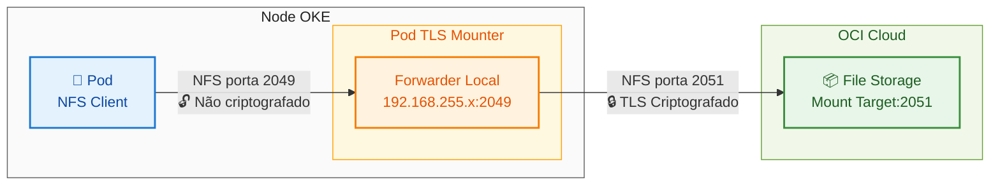
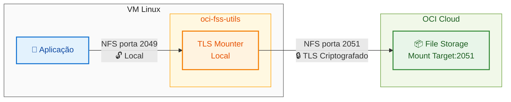
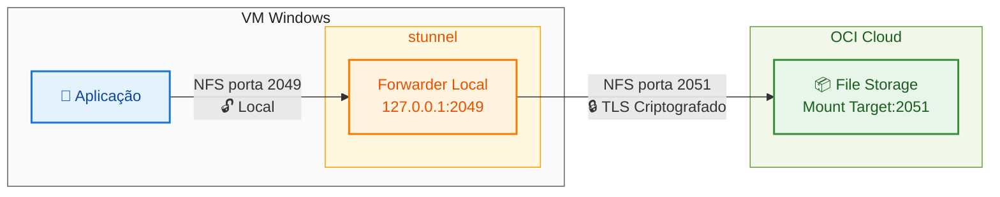

# OCI File Storage Service
# Criptografia TLS em Trânsito
## Guia de Configuração e Validação para OKE, VM Linux e VM Windows

---

## Visão Geral

Este documento fornece instruções abrangentes para configurar e validar a criptografia TLS em trânsito com o Oracle Cloud Infrastructure (OCI) File Storage Service (FSS).

Este guia abrange três cenários:
- **OKE (Kubernetes):** Configuração para pods no Oracle Container Engine for Kubernetes
- **VM Linux:** Configuração para máquinas virtuais Linux (Oracle Linux, etc.)
- **VM Windows:** Configuração para máquinas virtuais Windows usando stunnel

Quando configurado adequadamente, todos os dados transmitidos são criptografados usando TLS, garantindo a segurança dos dados durante o trânsito.

---

## Índice

1. [Configuração para OKE (Kubernetes)](#configuração-para-oke-kubernetes)
2. [Configuração para VM Linux](#configuração-para-vm-linux)
3. [Configuração para VM Windows](#configuração-para-vm-windows)
4. [Informações Adicionais](#informações-adicionais)

---

## Configuração para OKE (Kubernetes)

### Visão Geral da Arquitetura (OKE)

A arquitetura de criptografia TLS consiste nos seguintes componentes:

- **Pod da Aplicação**: Monta o sistema de arquivos usando NFS padrão (não criptografado localmente)
- **Endpoint Forwarder Local**: Um endereço IP virtual (por exemplo, 192.168.255.x) criado pelo TLS mounter
- **Pod FSS TLS Mounter**: Executa no nó OKE, escuta na porta 2049 e encaminha tráfego com criptografia TLS
- **OCI File Storage Mount Target**: Recebe tráfego criptografado na porta 2051 (NFS criptografado com TLS)

### Fluxo de Dados


---

### Pré-requisitos (OKE)

- Uma tenancy OCI ativa com cluster OKE implantado
- Acesso kubectl ao seu cluster OKE
- OCI File Storage Service mount target criado
- Conectividade de rede entre nós OKE e FSS mount target

---

### Instruções de Configuração (OKE)

#### Passo 1: Instalar o pacote oci-fss-utils no Nó do OKE

O pacote `oci-fss-utils` é necessário para habilitar a criptografia TLS em trânsito. Este pacote contém o TLS mounter que estabelece conexões seguras com o OCI File Storage.

**Configurar script de inicialização no Node Pool**

Ao criar ou editar o Node Pool no OKE, configure o seguinte script de inicialização (cloud-init):
```bash
#!/bin/bash
curl --fail -H "Authorization: Bearer Oracle" -L0 http://169.254.169.254/opc/v2/instance/metadata/oke_init_script | base64 --decode >/var/run/oke-init.sh

bash /var/run/oke-init.sh

dnf config-manager --enable ol8_developer
dnf install -y oci-fss-utils

touch /var/log/oke.done
```

**Como configurar no OCI Console:**

1. Navegue até **Developer Services** → **Kubernetes Clusters (OKE)**
2. Selecione seu cluster
3. Vá em **Node Pools** → selecione o node pool ou crie um novo
4. Em **Show advanced options** → **Initialization script**
5. Cole o script acima
6. Salve as alterações

**Nota:** Para node pools existentes, você precisará reciclar os nós para que o script seja executado.

**Verificar instalação:**
```bash
# Via SSH no nó
rpm -q oci-fss-utils
```

**Saída esperada:**
```
oci-fss-utils-<versão>.x86_64
```

#### Passo 2: Criar Recursos Kubernetes com Criptografia TLS

Crie um arquivo YAML (por exemplo, `fss-tls-setup.yaml`) com a seguinte configuração:

**Obs:** O parâmetro `encryptInTransit: "true"` no PersistentVolume é fundamental para habilitar a criptografia TLS.
```yaml
---
apiVersion: v1
kind: PersistentVolume
metadata:
  name: fss-pv
spec:
  capacity:
    storage: 50Gi
  volumeMode: Filesystem
  accessModes:
    - ReadWriteMany
  persistentVolumeReclaimPolicy: Retain
  csi:
    driver: fss.csi.oraclecloud.com
    volumeHandle: <SEU_OCID_FILESYSTEM>:<FQDN_MOUNT_TARGET>:<CAMINHO_EXPORT>
    volumeAttributes:
      encryptInTransit: "true"  # ← CRÍTICO PARA HABILITAR TLS
---
apiVersion: v1
kind: PersistentVolumeClaim
metadata:
  name: fss-pvc
spec:
  accessModes:
    - ReadWriteMany
  storageClassName: ""
  resources:
    requests:
      storage: 50Gi
  volumeName: fss-pv
---
apiVersion: v1
kind: Pod
metadata:
  name: fss-test-pod
spec:
  containers:
    - name: app
      image: busybox
      command: ["sh", "-c", "sleep 3600"]
      volumeMounts:
        - name: fss-volume
          mountPath: /mnt/fss
  volumes:
    - name: fss-volume
      persistentVolumeClaim:
        claimName: fss-pvc
```

#### Passo 3: Substituir Valores de Placeholder

No YAML acima, substitua os seguintes placeholders pelos seus valores reais:

- `<SEU_OCID_FILESYSTEM>`: Seu OCID do OCI File Storage (ex: ocid1.filesystem.oc1.region...)
- `<FQDN_MOUNT_TARGET>`: Nome de domínio totalmente qualificado do seu mount target
- `<CAMINHO_EXPORT>`: Seu caminho de export (ex: /FileSystem-AAAAMMDD-HHMM-XX)

**Exemplo de volumeHandle:**
```
ocid1.filesystem.oc1.sa_saopaulo_1.aaaa...aaaa:mttest.subnet.vcn.oraclevcn.com:/FileSystem-20260203-1454-22
```

#### Passo 4: Implantar os Recursos

Aplique a configuração ao seu cluster Kubernetes:
```bash
kubectl apply -f fss-tls-setup.yaml
```

#### Passo 5: Verificar que o Pod está Executando

Verifique se o pod está em execução e o volume está montado:
```bash
kubectl get pod fss-test-pod
```

**Saída esperada:**
```
NAME           READY   STATUS    RESTARTS   AGE
fss-test-pod   1/1     Running   0          2m
```

---

### Passos de Validação (OKE)

Siga estes passos para verificar que a criptografia TLS em trânsito está ativa e funcionando corretamente.

#### Passo 1: Verificar Configuração do PersistentVolume

Confirme que o PersistentVolume tem `encryptInTransit` habilitado:
```bash
kubectl get pv fss-pv -o yaml | grep -A 5 volumeAttributes
```

**Saída esperada:**
```yaml
volumeAttributes:
  encryptInTransit: "true"
```

#### Passo 2: Identificar o Pod TLS Mounter

Localize o pod FSS TLS mounter executando no namespace kube-system:
```bash
kubectl get pods -n kube-system -o wide | grep fss
```

**Saída esperada (exemplo):**
```
fss-tls-mounter-vnnqg   1/1   Running   0   3d23h   10.0.10.206   10.0.10.206
```

**Nota:** O nome do pod será diferente no seu ambiente. Este pod é responsável por criar o forwarder local e estabelecer conexões TLS com o OCI FSS.

#### Passo 3: Verificar Montagem Dentro do Pod

Verifique os detalhes de montagem NFS dentro do seu pod de aplicação:
```bash
kubectl exec fss-test-pod -- mount | grep fss
```

**Saída esperada (exemplo):**
```
192.168.255.252:/FileSystem-20260203-1454-22 on /mnt/fss type nfs
(rw,relatime,vers=3,rsize=1048576,wsize=1048576,namlen=255,hard,
proto=tcp,port=2049,timeo=600,retrans=2,sec=sys,
mountaddr=192.168.255.252,mountvers=3,mountport=2048,
mountproto=tcp,local_lock=none,addr=192.168.255.252)
```

**Observação chave:** O endereço IP (192.168.255.x) é o **endpoint forwarder local**, não o mount target real do OCI FSS. Este é o comportamento esperado.

#### Passo 4: Testar Operações de Arquivo

Verifique se as operações de arquivo funcionam corretamente:
```bash
kubectl exec fss-test-pod -- sh -c 'echo "teste-$(date +%s)" > /mnt/fss/teste.txt && cat /mnt/fss/teste.txt && rm /mnt/fss/teste.txt'
```

**Saída esperada:**
```
teste-1770145606
```

Se este comando for bem-sucedido, seu sistema de arquivos está montado e funcional.

#### Passo 5: Verificar Conexões TLS Criptografadas

**Este é o teste definitivo para confirmar que a criptografia TLS está ativa.**

Verifique as conexões de rede do pod TLS mounter. Substitua `fss-tls-mounter-vnnqg` pelo nome real do seu pod do Passo 2:
```bash
kubectl exec -n kube-system <nome-pod-fss-tls-mounter> -- ss -tan | grep -E '2049|2051'
```

**Exemplo de comando:**
```bash
kubectl exec -n kube-system fss-tls-mounter-vnnqg -- ss -tan | grep -E '2049|2051'
```

**Saída esperada (linhas críticas):**
```
ESTAB  0  0  192.168.255.0:988    192.168.255.252:2049
ESTAB  0  0  [::ffff:10.0.10.206]:185  [::ffff:10.0.10.73]:2051
```

##### Entendendo a Saída

| Tipo de Conexão | Descrição |
|-----------------|-----------|
| **Porta 2049** | **Conexão local:** Seu pod conecta ao forwarder (não criptografado localmente) |
| **Porta 2051** | **Conexão TLS criptografada:** Forwarder para OCI FSS mount target (**CRIPTOGRAFADO**) |

**✓ Indicador de Sucesso:** Se você vê conexões ESTABLISHED para a porta 2051, a criptografia TLS está ativa!

---

### Resolução de Problemas (OKE)

#### Pod Não Está Iniciando

Verifique os eventos do pod:
```bash
kubectl describe pod fss-test-pod
```

**Problemas comuns:**

- PVC não vinculado: Verifique configuração de PV e PVC
- Conectividade de rede: Verifique se os nós OKE podem alcançar o FSS mount target
- Regras de security list: Certifique-se de que a porta 2051 está aberta nas security lists da VCN

#### Nenhum Pod TLS Mounter Encontrado

Se nenhum pod FSS TLS mounter existe:

- Verifique se o CSI driver está instalado: Procure pods fss-csi no namespace kube-system
- Certifique-se de que `encryptInTransit: "true"` está configurado no PersistentVolume
- O pod TLS mounter é criado automaticamente quando um PV com criptografia é montado

#### Operações de Arquivo Falham

Verifique o status de montagem:
```bash
kubectl exec fss-test-pod -- df -h /mnt/fss
```

Verifique os logs do TLS mounter:
```bash
kubectl logs -n kube-system <nome-pod-fss-tls-mounter> --tail=50
```

#### Sem Conexões na Porta 2051

Se você não vê conexões para a porta 2051:

- Verifique `encryptInTransit: "true"` na configuração do PV
- Verifique se as regras de firewall permitem tráfego na porta 2051
- Verifique se a security list na VCN OCI permite saída para FSS na porta 2051
- Gere tráfego de I/O de arquivo e verifique as conexões novamente

---

## Configuração para VM Linux

Esta seção descreve como configurar a criptografia TLS em trânsito para máquinas virtuais Linux (Oracle Linux 8+) que acessam o OCI File Storage Service.

### Visão Geral da Arquitetura (VM Linux)


### Pré-requisitos (VM Linux)

- VM com Oracle Linux 8 ou superior
- Acesso root ou sudo
- Conectividade de rede com o OCI File Storage mount target
- Security lists configuradas para permitir tráfego nas portas 2048, 2049 e 2051

---

### Instruções de Configuração (VM Linux)

#### Passo 1: Instalar o pacote oci-fss-utils

O pacote `oci-fss-utils` é necessário para habilitar a criptografia TLS em trânsito.

**Opção A: Instalação manual**
```bash
sudo dnf config-manager --enable ol8_developer
sudo dnf install -y oci-fss-utils
```

**Opção B: Usando cloud-init (script de inicialização)**

Configure o seguinte script de inicialização ao criar a VM:
```bash
#!/bin/bash

dnf config-manager --enable ol8_developer
dnf install -y oci-fss-utils

touch /var/log/init.done
```

**Como configurar no OCI Console:**

1. Navegue até **Compute** → **Instances** → **Create Instance**
2. Em **Show advanced options** → **Management**
3. Em **Cloud-init script**, cole o script acima
4. Continue com a criação da instância

**Verificar instalação:**
```bash
rpm -q oci-fss-utils
```

**Saída esperada:**
```
oci-fss-utils-<versão>.x86_64
```

#### Passo 2: Criar o Ponto de Montagem

Crie o diretório onde o sistema de arquivos será montado:
```bash
sudo mkdir -p /mnt/fss
```

#### Passo 3: Montar o File Storage com Criptografia TLS

Use o comando `mount` com o tipo `oci-fss` e a opção `fips` para habilitar a criptografia TLS:
```bash
sudo mount -t oci-fss -o fips <FQDN_MOUNT_TARGET>:<CAMINHO_EXPORT> /mnt/fss
```

**Exemplo:**
```bash
sudo mount -t oci-fss -o fips mttest.subedb0f8d96.fsstestecluster.oraclevcn.com:/FileSystem-20260203-1454-22 /mnt/fss
```

**Parâmetros:**

| Parâmetro | Descrição |
|-----------|-----------|
| `-t oci-fss` | Tipo de sistema de arquivos OCI FSS com suporte a TLS |
| `-o fips` | Habilita criptografia TLS (FIPS-compliant) |
| `<FQDN_MOUNT_TARGET>` | Nome de domínio completo do mount target |
| `<CAMINHO_EXPORT>` | Caminho do export (ex: /FileSystem-20260203-1454-22) |

**Nota:** O OCID do filesystem não é necessário no comando mount para VMs, diferente da configuração no OKE.

#### Passo 4: Configurar Montagem Automática (Opcional)

Para montar automaticamente o sistema de arquivos no boot, adicione uma entrada no `/etc/fstab`:
```bash
sudo sh -c 'echo "<FQDN_MOUNT_TARGET>:<CAMINHO_EXPORT> /mnt/fss oci-fss fips,_netdev 0 0" >> /etc/fstab'
```

**Exemplo:**
```bash
sudo sh -c 'echo "mttest.subedb0f8d96.fsstestecluster.oraclevcn.com:/FileSystem-20260203-1454-22 /mnt/fss oci-fss fips,_netdev 0 0" >> /etc/fstab'
```

**Nota:** A opção `_netdev` garante que a montagem seja adiada até que a rede esteja disponível.

---

### Validação (VM Linux)

#### Verificar Montagem

Confirme que o sistema de arquivos está montado:
```bash
mount | grep oci-fss
```

Ou:
```bash
df -h /mnt/fss
```

#### Testar Operações de Arquivo

Verifique se as operações de arquivo funcionam corretamente:
```bash
sudo sh -c 'echo "teste-$(date +%s)" > /mnt/fss/teste.txt && cat /mnt/fss/teste.txt && rm /mnt/fss/teste.txt'
```

**Saída esperada:**
```
teste-1770145606
```

#### Verificar Conexões TLS Criptografadas

**Este é o teste definitivo para confirmar que a criptografia TLS está ativa.**

Verifique as conexões de rede nas portas 2049 e 2051:
```bash
ss -tan | grep -E '2049|2051'
```

**Saída esperada:**
```
ESTAB  0  0  10.0.10.50:xxxxx    10.0.10.73:2051
```

**✓ Indicador de Sucesso:** Se você vê conexões ESTABLISHED para a porta **2051**, a criptografia TLS está ativa!

| Porta | Significado |
|-------|-------------|
| **2049** | Conexão NFS padrão (não criptografada) |
| **2051** | Conexão NFS criptografada com TLS (**CRIPTOGRAFADO**) |

---

### Resolução de Problemas (VM Linux)

#### Erro: mount: unknown filesystem type 'oci-fss'

O pacote `oci-fss-utils` não está instalado. Execute:
```bash
sudo dnf config-manager --enable ol8_developer
sudo dnf install -y oci-fss-utils
```

#### Erro: Connection refused ou timeout

Verifique:
- Conectividade de rede com o mount target
- Security lists permitem tráfego nas portas 2048, 2049 e 2051
- O mount target está ativo no OCI Console

#### Sem conexões na porta 2051

Se você não vê conexões para a porta 2051:
- Verifique se usou `-o fips` no comando mount
- Verifique as regras de firewall (firewalld, iptables)
- Gere tráfego de I/O de arquivo e verifique as conexões novamente

---

## Configuração para VM Windows

Esta seção descreve como configurar a criptografia TLS em trânsito para máquinas virtuais Windows que acessam o OCI File Storage Service usando stunnel.

### Visão Geral da Arquitetura (VM Windows)


### Pré-requisitos (VM Windows)

- VM com Windows Server 2016 ou superior
- Acesso de Administrador
- Conectividade de rede com o OCI File Storage mount target
- Security lists configuradas para permitir tráfego nas portas 111, 2048, 2049, 2050 e 2051

---

### Instruções de Configuração (VM Windows)

#### Parte 1: Script de Inicialização da VM

Ao criar a VM Windows no OCI, use este script de inicialização para instalar automaticamente o NFS Client e o stunnel.

##### Passos no OCI Console:

1. Navegue até **Compute** → **Instances** → **Create Instance**
2. Selecione uma imagem Windows Server
3. Expanda **"Show advanced options"**
4. Vá para a aba **"Management"**
5. No campo **"Cloud-init script"** ou **"Initialization script"**, cole o seguinte script:
```yaml
#ps1_sysnative

# Windows VM Initialization Script for In-Transit Encryption
$ErrorActionPreference = "Stop"
$logFile = "C:\init-script.log"

function Write-Log {
    param($Message)
    $timestamp = Get-Date -Format "yyyy-MM-dd HH:mm:ss"
    "$timestamp - $Message" | Out-File -FilePath $logFile -Append
    Write-Host $Message
}

Write-Log "Starting Windows VM initialization for in-transit encryption..."

# Step 1: Install NFS Client
Write-Log "Installing NFS Client feature..."
try {
    Install-WindowsFeature -Name NFS-Client -IncludeManagementTools
    Write-Log "NFS Client installed successfully"
} catch {
    Write-Log "ERROR: Failed to install NFS Client - $_"
    exit 1
}

# Step 2: Download and Install stunnel
Write-Log "Downloading and installing stunnel..."

$stunnelUrl = "https://www.stunnel.org/downloads/stunnel-5.71-win64-installer.exe"
$stunnelInstaller = "C:\temp\stunnel-installer.exe"

New-Item -ItemType Directory -Force -Path "C:\temp" | Out-Null

try {
    Write-Log "Downloading stunnel..."
    Invoke-WebRequest -Uri $stunnelUrl -OutFile $stunnelInstaller -UseBasicParsing
    
    Write-Log "Installing stunnel..."
    Start-Process -FilePath $stunnelInstaller -ArgumentList "/S" -Wait
    
    Write-Log "stunnel installed successfully"
} catch {
    Write-Log "ERROR: Failed to download/install stunnel - $_"
    exit 1
}

Write-Log "Initialization complete! NFS Client and stunnel are installed."
Write-Log "You can configure stunnel later at: C:\Program Files (x86)\stunnel\config\stunnel.conf"
```

6. Complete o processo de criação da VM
7. Aguarde 5-10 minutos após a criação da VM para que o script de inicialização seja concluído

##### Verificar a Instalação:

Após a VM estar em execução, verifique o log de inicialização:
```powershell
Get-Content C:\init-script.log
```

---

#### Parte 2: Configuração Pós-Criação

Após a VM ser criada e o script de inicialização ter sido concluído, você precisa configurar o stunnel e montar seu compartilhamento NFS.

##### IMPORTANTE: Executar PowerShell como Administrador

**Você DEVE executar o PowerShell como Administrador para que estes comandos funcionem.**

###### Como Abrir PowerShell como Administrador:

1. Clique no botão Iniciar do Windows
2. Digite "PowerShell"
3. **Clique com o botão direito** em "Windows PowerShell"
4. Selecione **"Executar como administrador"**
5. Clique em "Sim" quando solicitado pelo Controle de Conta de Usuário (UAC)

---

##### Script de Configuração

Depois de ter o PowerShell aberto como Administrador, execute o seguinte script:

**Atualize as variáveis primeiro:**
- `$nfsServerIP` - Endereço IP do seu servidor NFS (ex: "10.0.10.73")
- `$nfsExportPath` - Caminho de export do seu NFS (ex: "FileSystem-20260203-1454-22")
- `$driveLetter` - A letra do drive que você deseja usar (ex: "Z:")
```powershell
# Configure stunnel and mount NFS share
# IMPORTANTE: Execute este script no PowerShell como Administrador

$ErrorActionPreference = "Stop"

# ========================================
# ATUALIZE ESTAS VARIÁVEIS
# ========================================
$nfsServerIP = "10.0.10.73"
$nfsExportPath = "FileSystem-20260203-1454-22"
$driveLetter = "Z:"
# ========================================

# stunnel configuration
$stunnelConfigPath = "C:\Program Files (x86)\stunnel\config\stunnel.conf"

$stunnelConfig = @"
[mount]
    client=yes
    accept=127.0.0.1:2048
    connect=$nfsServerIP:2051
 
[nfs]
    client=yes
    accept=127.0.0.1:2049
    connect=$nfsServerIP:2051
 
[nlm]
    client=yes
    accept=127.0.0.1:2050
    connect=$nfsServerIP:2051
 
[rpcbind]
    client=yes
    accept=127.0.0.1:111
    connect=$nfsServerIP:2051
"@

Write-Host "Updating stunnel configuration..." -ForegroundColor Cyan

try {
    # Write configuration to file
    $stunnelConfig | Out-File -FilePath $stunnelConfigPath -Encoding ASCII -Force
    Write-Host "✓ stunnel configuration updated successfully" -ForegroundColor Green
} catch {
    Write-Host "✗ Failed to update stunnel config: $_" -ForegroundColor Red
    exit 1
}

# Start or restart stunnel
Write-Host "Starting stunnel..." -ForegroundColor Cyan
try {
    $stunnelExe = "C:\Program Files (x86)\stunnel\bin\stunnel.exe"
    
    # Kill existing stunnel processes
    Get-Process stunnel -ErrorAction SilentlyContinue | Stop-Process -Force
    Start-Sleep -Seconds 2
    
    # Start stunnel
    Start-Process -FilePath $stunnelExe -WorkingDirectory "C:\Program Files (x86)\stunnel\bin"
    Start-Sleep -Seconds 3
    
    Write-Host "✓ stunnel started" -ForegroundColor Green
} catch {
    Write-Host "✗ Failed to start stunnel: $_" -ForegroundColor Red
    Write-Host "Try running manually: C:\Program Files (x86)\stunnel\bin\stunnel.exe" -ForegroundColor Yellow
}

# Mount NFS share using the actual mount.exe command
Write-Host "Mounting NFS share..." -ForegroundColor Cyan
try {
    # Use full path to mount.exe to avoid PowerShell alias conflict
    $mountExe = "C:\Windows\System32\mount.exe"
    
    & $mountExe -o anon "\\127.0.0.1\$nfsExportPath" $driveLetter
    
    Write-Host "✓ NFS share mounted successfully to $driveLetter" -ForegroundColor Green
} catch {
    Write-Host "✗ Failed to mount NFS share: $_" -ForegroundColor Red
    exit 1
}

Write-Host "`nConfiguration complete!" -ForegroundColor Green
Write-Host "Drive $driveLetter is now available" -ForegroundColor Green
```

---

##### Alternativa: Comandos Individuais

Se você preferir executar comandos individuais em vez do script completo, use estes (lembre-se de atualizar os valores):
```powershell
# 1. Atualizar configuração do stunnel
@"
[mount]
    client=yes
    accept=127.0.0.1:2048
    connect=10.0.10.73:2051
 
[nfs]
    client=yes
    accept=127.0.0.1:2049
    connect=10.0.10.73:2051
 
[nlm]
    client=yes
    accept=127.0.0.1:2050
    connect=10.0.10.73:2051
 
[rpcbind]
    client=yes
    accept=127.0.0.1:111
    connect=10.0.10.73:2051
"@ | Out-File -FilePath "C:\Program Files (x86)\stunnel\config\stunnel.conf" -Encoding ASCII -Force

# 2. Parar qualquer processo stunnel existente
Get-Process stunnel -ErrorAction SilentlyContinue | Stop-Process -Force

# 3. Iniciar stunnel
Start-Process "C:\Program Files (x86)\stunnel\bin\stunnel.exe" -WorkingDirectory "C:\Program Files (x86)\stunnel\bin"

# 4. Aguardar inicialização do stunnel
Start-Sleep -Seconds 3

# 5. Montar o compartilhamento NFS
& C:\Windows\System32\mount.exe -o anon \\127.0.0.1\FileSystem-20260203-1454-22 Z:
```

---

### Validação (VM Windows)

#### Verificar se o stunnel está em execução:
```powershell
Get-Process stunnel
```

**Saída esperada:**
```
Handles  NPM(K)    PM(K)      WS(K)     CPU(s)     Id  SI ProcessName
-------  ------    -----      -----     ------     --  -- -----------
    XXX      XX    XXXXX      XXXXX       X.XX   XXXX   X stunnel
```

#### Verificar se o compartilhamento NFS está montado:
```powershell
Get-PSDrive
```

Você deve ver sua letra de drive (ex: Z:) na lista.

Ou use:
```powershell
net use
```

#### Acessar seu drive montado:
```powershell
cd Z:
dir
```

Ou simplesmente abra o Explorador de Arquivos e navegue até o drive Z:.

#### Testar Operações de Arquivo:
```powershell
echo "teste-$(Get-Date -Format 'yyyyMMddHHmmss')" > Z:\teste.txt
Get-Content Z:\teste.txt
Remove-Item Z:\teste.txt
```

#### Verificar Conexões TLS Criptografadas

**Este é o teste definitivo para confirmar que a criptografia TLS está ativa.**

Verifique as conexões de rede nas portas 2049 e 2051:
```powershell
netstat -an | findstr "2049 2051"
```

**Saída esperada:**
```
TCP    127.0.0.1:111          0.0.0.0:0              LISTENING
TCP    127.0.0.1:2048         0.0.0.0:0              LISTENING
TCP    127.0.0.1:2049         0.0.0.0:0              LISTENING
TCP    127.0.0.1:2050         0.0.0.0:0              LISTENING
TCP    10.0.10.X:XXXXX        10.0.10.73:2051        ESTABLISHED
```

**✓ Indicador de Sucesso:** Se você vê uma conexão ESTABLISHED para a porta **2051**, a criptografia TLS está ativa!

| Porta | Significado |
|-------|-------------|
| **111, 2048, 2049, 2050** | Portas locais do stunnel (não criptografadas localmente) |
| **2051** | Conexão NFS criptografada com TLS para OCI FSS (**CRIPTOGRAFADO**) |

---

### Resolução de Problemas (VM Windows)

#### Erro: "Acesso Negado" ao executar comandos PowerShell

**Solução:** Certifique-se de que você abriu o PowerShell como Administrador (veja as instruções acima)

#### stunnel não está iniciando

**Solução:** Inicie o stunnel manualmente:
```powershell
Start-Process "C:\Program Files (x86)\stunnel\bin\stunnel.exe"
```

#### Comando mount falha

**Solução:** Verifique se:
1. O stunnel está em execução: `Get-Process stunnel`
2. O NFS Client está instalado: `Get-WindowsFeature NFS-Client`
3. O endereço IP do servidor NFS e o caminho de export estão corretos

#### Não é possível conectar ao compartilhamento NFS

**Solução:** Verifique a configuração do stunnel:
```powershell
Get-Content "C:\Program Files (x86)\stunnel\config\stunnel.conf"
```

Verifique se o endereço IP corresponde ao seu servidor NFS.

#### Sem conexões na porta 2051

Se você não vê conexões para a porta 2051:
- Verifique se o stunnel está configurado corretamente
- Verifique as regras de firewall do Windows
- Verifique as security lists na VCN OCI
- Gere tráfego de I/O de arquivo e verifique as conexões novamente

---

## Informações Adicionais

### Referência de Portas

| Porta | Propósito | Plataforma |
|-------|-----------|------------|
| **111** | RPC Portmapper | Windows (stunnel) |
| **2048** | Protocolo de montagem NFS | Todas |
| **2049** | **Porta NFS padrão** (não criptografada localmente) | Todas |
| **2050** | Network Lock Manager (NLM) | Windows (stunnel) |
| **2051** | **Porta NFS criptografada com TLS** (**CRIPTOGRAFADO**) | Todas |

### Considerações de Segurança

- **Dados em trânsito:** Criptografados com TLS entre clientes e OCI FSS quando a criptografia está habilitada
- **Dados em repouso:** OCI File Storage criptografa todos os dados em repouso por padrão usando chaves gerenciadas pela Oracle
- **Comunicação local:** 
  - **OKE:** Não criptografada entre pod e forwarder (ambos no mesmo nó, isolados na rede Kubernetes)
  - **VM Linux:** Comunicação local usando oci-fss-utils
  - **VM Windows:** Não criptografada entre aplicação e stunnel (ambos na mesma VM)
- **Isolamento de rede:** Use security lists da VCN e network security groups para restringir acesso aos mount targets FSS

### Considerações de Performance

- A criptografia TLS adiciona latência mínima (tipicamente < 5% de overhead)
- **OKE/Linux:** O TLS mounter lida com criptografia/descriptografia eficientemente usando aceleração de hardware quando disponível
- **Windows:** O stunnel pode utilizar aceleração de hardware para operações criptográficas
- Para cargas de trabalho de alto throughput, monitore o uso de CPU para garantir recursos adequados

### Matriz de Comparação de Plataformas

| Aspecto | OKE (Kubernetes) | VM Linux | VM Windows |
|---------|------------------|----------|------------|
| **Software requerido** | oci-fss-utils | oci-fss-utils | NFS Client + stunnel |
| **Tipo de montagem** | CSI Driver | mount -t oci-fss | mount.exe via stunnel |
| **Configuração** | YAML (PV/PVC) | Comando/fstab | Script PowerShell |
| **Porta TLS** | 2051 | 2051 | 2051 |
| **Instalação** | Node pool init script | Cloud-init ou manual | Cloud-init script |
| **Verificação TLS** | kubectl exec + ss | ss -tan | netstat -an |

---

## Resumo

A criptografia TLS em trânsito para o OCI File Storage Service fornece uma camada adicional de segurança para seus dados em todas as plataformas.

### Para OKE (Kubernetes)

Seguindo este guia, você:

1. Instalou o oci-fss-utils nos nós OKE via script de inicialização
2. Configurou um PersistentVolume com `encryptInTransit: "true"`
3. Implantou recursos Kubernetes para montar OCI FSS com criptografia TLS
4. Verificou que o pod TLS mounter está lidando com criptografia de forma transparente
5. Confirmou conexões TLS ativas na porta 2051
6. Testou operações de arquivo para garantir funcionamento correto

### Para VM Linux

Seguindo este guia, você:

1. Instalou o pacote `oci-fss-utils` na VM (via cloud-init ou manualmente)
2. Montou o OCI FSS usando `mount -t oci-fss -o fips`
3. Confirmou conexões TLS ativas na porta 2051
4. Testou operações de arquivo para garantir funcionamento correto
5. (Opcional) Configurou montagem automática via /etc/fstab

### Para VM Windows

Seguindo este guia, você:

1. Usou script cloud-init para instalar NFS Client e stunnel automaticamente
2. Configurou o stunnel com as portas necessárias para NFS
3. Montou o compartilhamento NFS via stunnel (127.0.0.1)
4. Confirmou conexões TLS ativas na porta 2051
5. Testou operações de arquivo para garantir funcionamento correto

### Resultado Final (Todas as Plataformas)

- ✅ Túnel criptografado entre seu cliente e o servidor NFS
- ✅ Compartilhamento NFS acessível via drive local ou ponto de montagem
- ✅ Todo o tráfego criptografado em trânsito usando TLS
- ✅ Proteção de dados conforme melhores práticas de segurança